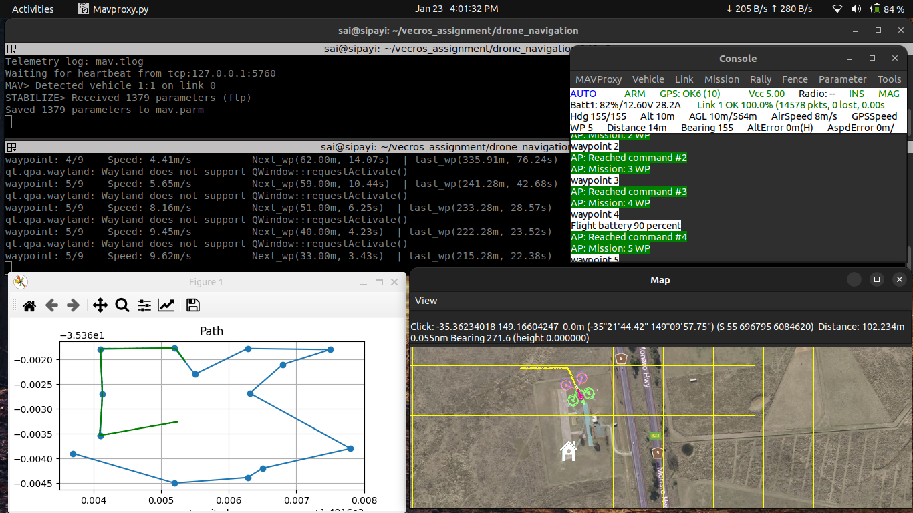
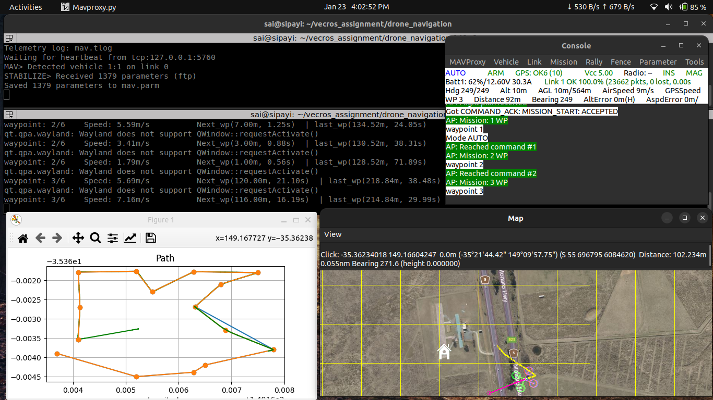
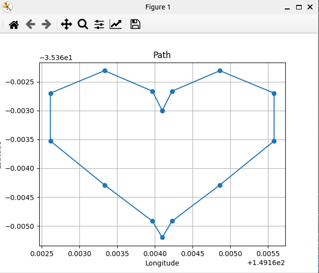

# VECROS INTERN ASSIGNMENT

In this repository I uploaded the codes for the two main problems in the UAV's
1. path planning
2. navigation and guidance

## Requirements
To run test the codes in this repository, we need some requirements, so let's download them first

### Installing ArduPilot
Ardupilot is an opensource flightcontrol software, for more information visit [Ardupilot Website](https://ardupilot.org/ardupilot/)

Run the below commands one by one to install Ardupilot and test the simulated drone SILT
```bash
mkdir ~/apm & cd ~/apm
git clone https://github.com/ArduPilot/ardupilot.git
cd ardupilot
git submodule update --init --recursive
./Tools/environment_install/install-prereqs-ubuntu.sh -y
./waf clean
./waf configure --board sitl
./waf copter
export PATH="$PATH:$HOME/apm/ardupilot/Tools/autotest" >> ~/.bashrc
source ~/.bashrc
```
### Installing Required Packages
pymavlink is a package to communicate with flight-control software like ArduPilot, to know more about drone programming visit [The Drone Dojo YT channel](https://www.youtube.com/playlist?list=PLgiealSjeVyx3t4N9GroE29SbVwhYrOtL
)

```bash
cd $HOME
git clone https://github.com/SiPAyi/vecros_assignment.git
cd vecros_assignment
pip install -r requirements.txt
```


## 1. Path Planning

There are many algorithms for path planning, which can be broadly classified into **graph-based** and **sampling-based** methods. **Graph-based algorithms** include A*, Dijkstra’s, Bellman-Ford, Theta*, and ARA*, which use a grid or graph representation of the environment and explore possible paths between nodes based on predefined costs. **Sampling-based algorithms** like RRT, RRT*, PRM, and their variants (e.g., Rapidly-exploring Random Tree, Probabilistic Roadmap Method) generate random samples in the search space to explore feasible paths. Other optimization-based algorithms like **Genetic Algorithm (GA)** and **Ant Colony Optimization (ACO)** rely on evolutionary principles and pheromone-based strategies to find paths in complex environments.

These algorithms vary in their approach, performance, and application suitability. Sampling-based methods like RRT and PRM work well in continuous, high-dimensional spaces, while graph-based algorithms like A* and Dijkstra's are better for grid or map-based environments.

### Existing Approaches
#### A* Algorithm 
A* algorithm finds the shortest path between two points by combining actual cost (G) and estimated cost (H) to calculate a total cost (F = G + H). It explores nodes with the smallest F, balancing efficiency and accuracy. It uses a heuristic (like Manhattan or Euclidean distance) to guide the search. A* guarantees the shortest path if the heuristic is appropriate, making it ideal for applications like robotics, games, and GPS navigation. checkout the [astar_planning.py](path_planning/astar_planning.py) file

*Figure: A-star Ouput*


#### RRT* (Rapidly-exploring Random Tree Star)
It is an improved version of RRT used for path planning. It grows a tree by randomly sampling points and connecting them to the nearest node, optimizing the path by rewiring nodes for lower costs. Unlike RRT, RRT* ensures the path is both feasible and as close to optimal as possible. It’s commonly used in robotics for navigation in complex environments. checkout the [rrtstar_planning.py](path_planning/rrtstar_planning.py) and [rrtstar_by_me.py](path_planning/rrtstar_by_me.py) files, i didn't tested them, but they are not completed


### My Approach
The algorithm I tried(without using chatgpt or any resource) is close to A* or Dijkstra algorithms, its searching for the endpoint moving across the grid, even it finds the solution, its exploring the total grid for different paths and selecting the sortest paths from all of them. checkout the [my_planning.py](path_planning/my_planning.py) file


*Figure: My Approach (2D version of the given problem statement)*


**Advantages**: 
1. finds the shortest path possible to reach the goal

**Disdvantage**:
1. To find the shortest path for each pair of starting and ending point it need to explore the total grid once
2. Requires lot of computaion and time

In my point of view RRT* algorithms is best to find the path in 3D grid(as per problem statement)


## 2. Waypoint Navigation
This part implements a waypoint monitoring system for a drone using GPS data and real-time flight logic. The drone follows a series of waypoints and dynamically adjusts its path during the mission based on various conditions. The system includes functionality for adding, removing, and modifying waypoints during flight, ensuring adaptive mission control and monitor the mission


### Algorithm and Implementation
#### Waypoint Navigation
* **Sending the waypoints:**
Send the predefined waypoints to the drone for the navigation using mavlink, in this we used `pymavlink` package

#### Waypoint Monitoring

* **Estimated Distance and Time Calculation:** Get the distance to the next waypoint from the `NAV_CONTROLLER_OUTPUT` message and get the speed from the `VFR_HUD` message. calculate the distance between the next waypoint to the last waypoint using a function, them calcute the estimated time from them

* **Waypoint Number:** Get the current and last waypoint numbers and use them to know the status of the mission


#### Takeoff:
* The drone is programmed to take off autonomously to a defined altitude before initiating waypoint navigation. This ensures obstacle clearance and stability.
* The altitude for takeoff is specified in the mission parameters or as a default value in the code.

#### Landing:
* Once the final waypoint is reached, the drone executes an automated landing sequence.
* Landing behavior includes gradual descent and ensuring stability on touch-down.

#### Flight Path Visualization
* Plot the waypoints using the matplotlib
* Update the plot dynamically while the drone is moving


### How to Run the Code
For this navigation project we are using a simulated drone **SITL(Software In The Loop)** provided by Ardupilot, so first we need to download that software. Follow the steps in the Requirements section, now we are good to go

Open the terminal and run the below command, it will launch the SITL, map and a console to monitor the drone
```bash
sim_vehicle.py -v ArduCopter --console --map
```
we can control the drone using the [mavlink](https://mavlink.io/en/) commands from the terminal as show in the below command
```bash
mode GUIDED
```
above command set the drone to `GUIDED` mode, also we can send commands to follow waypoints and so on

Now let's run the code to follow our pre-defined(this repo is located in you `HOME` directory)
```bash
cd $HOME/vecros_assignment/drone_navigation
python3 drone_navigation.py
```
After running the command you will see the result

you can also run the drone in any shape like love symbol, go to `shape_generator.py` file and create waypoints using your desired function as shown below

```python3
waypoints = generate_love_symbol_waypoints(center_lat=-35.3635, center_lon=149.1641)
```

### Output
#### Drone navigation to waypoints
Drone navigating through the predefined waypoints and the path is drawn using matplotlib to know the drone status, also printed the estimated value in the terminal

[](drone_navigation/drone_nav.webm)

#### Changing the waypoints during the mission
After reaching the 10th waypoint, drone added a new waypoint perpendicular to the direction of the drone in 100m, then continue the mission





#### Moving the drone in a shape
Generated some waypoints for moving in a desired shape using a function and make the drone to follow those waypoints




### Conclusion
This project demonstrates the functionality of waypoint monitoring and dynamic path adjustment for drone missions. The ability to update waypoints in-flight and return to home ensures flexibility in real-world applications. The system can be further extended to include obstacle avoidance, mission planning, and integration with more advanced flight control algorithms.
