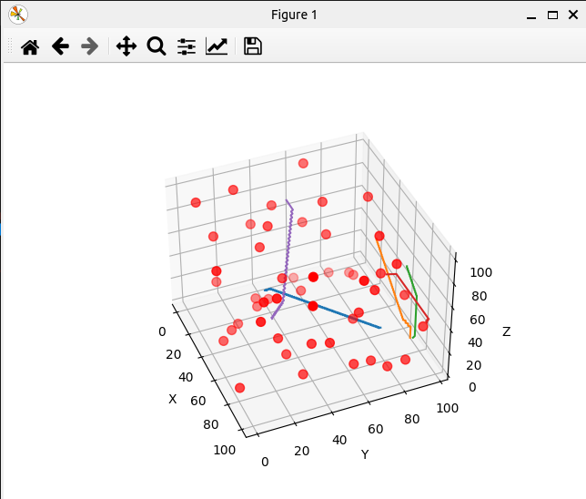
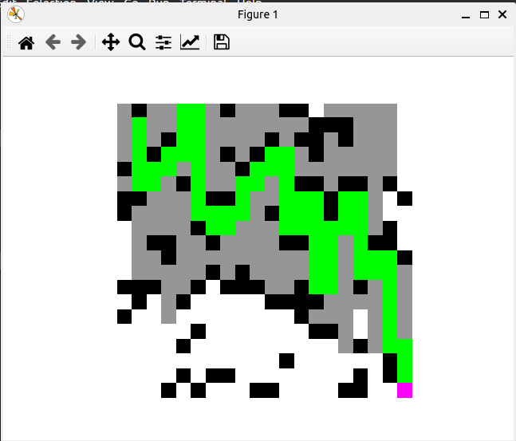

# VECROS INTERN ASSIGNMENT

In this repository I uploaded the codes for the two main problems in the UAV's
1. path planning
2. navigation and guidance

## Requirements
To run test the codes in this repository, we need some requirements, so let's download them first

### Installing ArduPilot
Ardupilot is an opensource flightcontrol software, for more information visit [Ardupilot Website](https://ardupilot.org/ardupilot/)

Run the below commands one by one to install Ardupilot and test the simulated drone SILT
```bash
mkdir ~/apm & cd ~/apm
git clone https://github.com/ArduPilot/ardupilot.git
cd ardupilot
git submodule update --init --recursive
./Tools/environment_install/install-prereqs-ubuntu.sh -y
./waf clean
./waf configure --board sitl
./waf copter
export PATH="$PATH:$HOME/apm/ardupilot/Tools/autotest" >> ~/.bashrc
source ~/.bashrc
sim_vehicle.py -v ArduCopter
```
### Installing Required Packages
Navigate to the folder where you installed this repo and run the below command. pymavlink is a package to communicate with flight-control software like ArduPilot, to know more about drone programming visit [The Drone Dojo YT channel](https://www.youtube.com/playlist?list=PLgiealSjeVyx3t4N9GroE29SbVwhYrOtL
)

```bash
pip install -r requirements.txt
```


## 1. Path Planning

There are many algorithms for path planning, which can be broadly classified into **graph-based** and **sampling-based** methods. **Graph-based algorithms** include A*, Dijkstra’s, Bellman-Ford, Theta*, and ARA*, which use a grid or graph representation of the environment and explore possible paths between nodes based on predefined costs. **Sampling-based algorithms** like RRT, RRT*, PRM, and their variants (e.g., Rapidly-exploring Random Tree, Probabilistic Roadmap Method) generate random samples in the search space to explore feasible paths. Other optimization-based algorithms like **Genetic Algorithm (GA)** and **Ant Colony Optimization (ACO)** rely on evolutionary principles and pheromone-based strategies to find paths in complex environments.

These algorithms vary in their approach, performance, and application suitability. Sampling-based methods like RRT and PRM work well in continuous, high-dimensional spaces, while graph-based algorithms like A* and Dijkstra's are better for grid or map-based environments.

### Existing Approaches
#### A* Algorithm 
A* algorithm finds the shortest path between two points by combining actual cost (G) and estimated cost (H) to calculate a total cost (F = G + H). It explores nodes with the smallest F, balancing efficiency and accuracy. It uses a heuristic (like Manhattan or Euclidean distance) to guide the search. A* guarantees the shortest path if the heuristic is appropriate, making it ideal for applications like robotics, games, and GPS navigation. checkout the [astar_planning.py](path_planning/astar_planning.py) file

*Figure: A-star Ouput*


#### RRT* (Rapidly-exploring Random Tree Star)
It is an improved version of RRT used for path planning. It grows a tree by randomly sampling points and connecting them to the nearest node, optimizing the path by rewiring nodes for lower costs. Unlike RRT, RRT* ensures the path is both feasible and as close to optimal as possible. It’s commonly used in robotics for navigation in complex environments. checkout the [rrtstar_planning.py](path_planning/rrtstar_planning.py) and [rrtstar_by_me.py](path_planning/rrtstar_by_me.py) files, i didn't tested them, but they are not completed


### My Approach
The algorithm I tried(without using chatgpt or any resource) is close to A* or Dijkstra algorithms, its searching for the endpoint moving across the grid, even it finds the solution, its exploring the total grid for different paths and selecting the sortest paths from all of them. checkout the [my_planning.py](path_planning/my_planning.py) file


*Figure: My Approach (2D version of the given problem statement)*


**Advantages**: 
1. finds the shortest path possible to reach the goal

**Disdvantage**:
1. To find the shortest path for each pair of starting and ending point it need to explore the total grid once
2. Requires lot of computaion and time

In my point of view RRT* algorithms is best to find the path in 3D grid(as per problem statement)


## 2. Waypoint Navigation

to be updated


